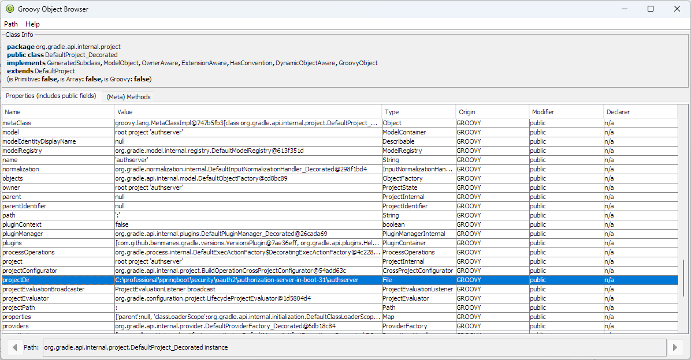

# vscode-gradle-ext README

Extends Gradle for Java VSCode extension.

**NEW:** Use ```vscode-gradle-ext.groovysh``` to run ```groovysh``` in the context of the gradle build.
**NEW:** Once the groovysh is launched try the following command:

```
Groovy Shell (4.0.14, JVM: 17.x.x)
Type ':help' or ':h' for help.
-------------------------------------------------------------------------------
groovy:000> :inspect project
```

to launch the ObjectBrowser GUI.


You can drill down the table rows by double clicking on the row.

## Features

|Name|Description|Contexts|
|-|-|-|
|vscode-gradle-ext.dependencyUpdates|Show Dependency Updates Report|Gradle Projects view title|
|vscode-gradle-ext.explorer|         Explorer                 |Gradle Projects view title|
|vscode-gradle-ext.groovysh|         Start groovysh in build context|Gradle Projects view title|
|vscode-gradle-ext.tiOrder|          Task order               |Gradle Projects view task item|
|vscode-gradle-ext.tiTree|           Task tree                |Gradle Projects view task item|
|vscode-gradle-ext.copyName|         Copy Name                |Gradle Projects view task item|
|vscode-gradle-ext.copyPath|         Copy Path                |Gradle Projects view task item|
|vscode-gradle-ext.helpTask|         Help Task                |Gradle Projects view task item|
|vscode-gradle-ext.dependencyInsight|Dependency Insight (Invoke on Dependency node only)|Gradle Projects view dependency item|
|vscode-gradle-ext.dependenciesConfiguration|Dependencies for Configuration (Invoke on Configuration node only)|Gradle Projects view configuration item|
|vscode-gradle-ext.copyLabel|        Copy Label               |Gradle Projects view tree item|

## Requirements

## Extension Settings

## Known Issues

## Release Notes

### 1.0.35

Initial release.
